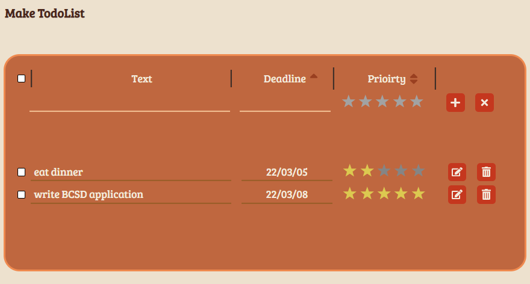

# hamburger-calendar

## 설명

- 기상 시간, 취침 시간, 작업(공부) 시간을 햄버거의 빵과 패티 모양으로 입력한다.
- 입력한 데이터들은 목표치와 비교하여 별점이 매겨진다.
- 캘린더처럼 다른 날짜에 입력한 데이터도 쉽게 확인할 수 있다.

## 사용 방법

[Hamburger-Calendar](https://hamburger-calendar.herokuapp.com/)

- 홈페이지 방문
  - 대부분의 기능들은 로그인 필요 (깃헙 로그인 가능)

## 제작 의도

- 시간 관리를 별점과 출석 체크를 통해 꾸준히 하게 위해 제작하였습니다.

## 기술 스택

- Frontend: React.js
- Backend: Node.js (express)
- Databse: Firebase
- Deploy: Heroku
- Document: swagger, markdown

## API 문서

[Swagger UI](https://hamburger-calendar.herokuapp.com/api-docs/)

## 기능 설명

- 캘린더
  - 클릭 시 원하는 날짜로 이동가능. 깃헙의 잔디기능처럼 어느 날짜에 활동했는 지 기록됨
    
    날짜
- 햄버거
  - WakeTime & Bed Time
    - 비어있는 회색 클릭 → 만들기 가능
      
      입력이 되지 않은 경우
    - 만들기: 시간을 입력 후 저장창
      
      입력 창
      
      입력 결과
    - 존재하는 요소 클릭 → 수정 가능
      - 수정: 시간을 입력 후 저장
  - WorkList
    - 비어있는 회색 클릭 → 만들기 가능
      - 만들기: 활동 이름과 활동한 시간을 입력 후 색깔을 지정 가능
        
        입력 창
        
        입력한 결과
    - 존재하는 요소 클릭 → 수정 가능
      - 수정: 활동 이름과 활동한 시간을 입력 후 색깔을 수정 가능
  - Get Grade
    - TargetTime (목표) 설정 후 클릭하면 TargetTime과 비교하여 별점을 평가
      
      별점 갱신 버튼
      - 마우스를 가져다 대면 세부 점수 확인 가능
        
        별점 확인하기
- Week Calendar
  - ←, → 로 이동 가능
  - 클릭 시 해당날짜로 이동
  - 제작했던 햄버거와 해당 별점을 확인 가능
    
    이미지
- Todo List
  - 설명과 마감일과 중요도를 입력 가능
  - ↑, ↓키로 마감일, 중요도 순으로 정렬 가능
    
    이미지
- Setting

  - 별점과 비교할 목표치를 설정
    
    세팅 페이지

- Log in
  - 로그인 페이지 (자체 로그인과 깃헙 로그인이 가능)
    
- Sign up
  - 회원가입 페이지
    
